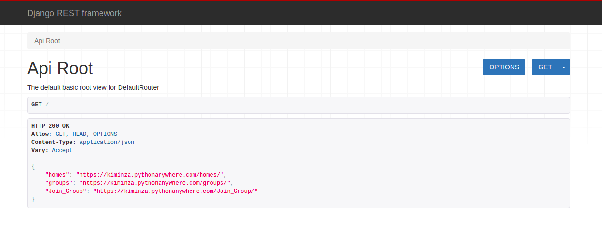
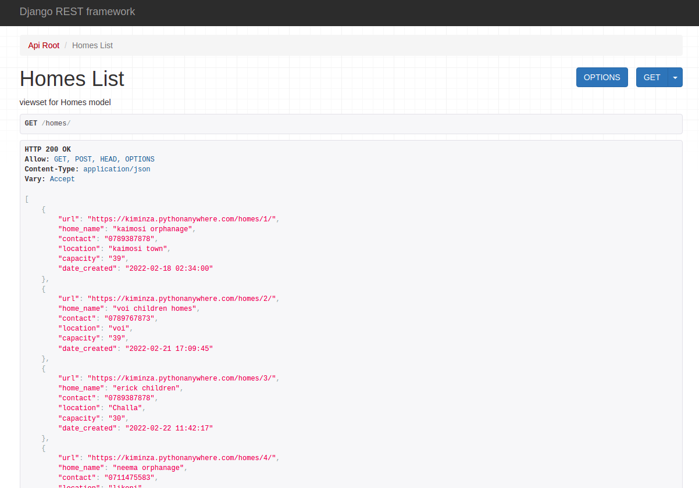

# Backend for my Portfolio Project (OFAN)

OFAN enables individuals to easily extend help to Orphans and Children Homes through contributions and visits.

This repo is the backend for the site and creates the various endpoints needed.

[Front End for this site](https://github.com/kiminzajnr/PortfolioProject-Frontend) and [Live](https://kiminzajnr.github.io/PortfolioProject-Frontend/)

Orphanages have been neglected and only a few people, and mostly churches are left to support them. This site aims at bringing everyone into play. They need our support.

---

---

---

#### Tech/Framework

> The endpoints are built using the django rest framework

---

#### Making it yours
> - clone this repo `git clone <project link>`
> - activate the virtual environment `source env/bin/activate env`
> - install required packages `pip install -r requirements.txt`
> - run migrations `python manage.py migrate`
> - create super user so you'll be able to add entries as admin `python manage.py createsuperuser`
> - run server `python manage.py runserver`
> - visit localhost to access the endpoints locally

---

#### Contribute

> anyone can contribute to this repo by opening a pull request. Contributions related to payment integrations and securing the api are highly welcomed.
